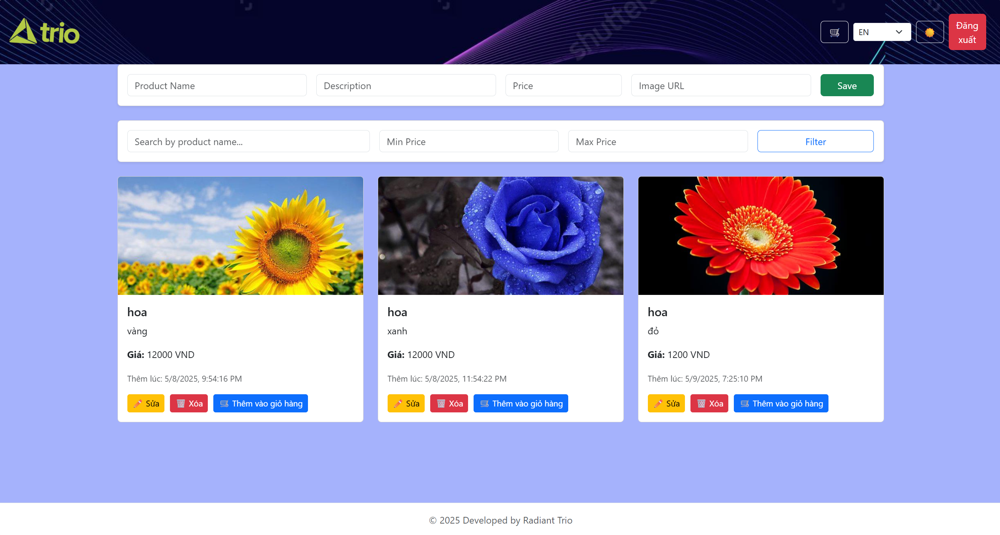

Website bán hàng đơn giản nhưng đầy đủ chức năng cơ bản và một số tính năng nâng cao nhằm nâng cao trải nghiệm người dùng. 

1. Quản lý người dùng.
   
- Đăng nhập:
    Người dùng có thể đăng nhập vào hệ thống bằng cách nhập email và mật khẩu. Hệ thống sẽ xác thực thông tin, chỉ cho phép truy cập nếu tài khoản hợp lệ.

- Đăng ký tài khoản:
    Cho phép người dùng tạo tài khoản mới bằng cách nhập tên, email và mật khẩu. Hệ thống sẽ kiểm tra xem email đã tồn tại hay chưa để tránh trùng lặp tài khoản.

2. Quản lý sản phẩm.
   
- Giao diện hiển thị danh sách các sản phẩm đang có trên hệ thống.

- Mỗi sản phẩm được trình bày đầy đủ thông tin: tên, mô tả, giá bán, hình ảnh minh họa, và thời gian tạo.

- Cho phép người quản trị thực hiện các thao tác: thêm, sửa, hoặc xóa sản phẩm một cách dễ dàng.

3. Giỏ hàng (Lưu bằng Local Storage).
   
- Khi người dùng chọn mua sản phẩm, sản phẩm đó sẽ được thêm vào giỏ hàng.

- Giỏ hàng được lưu trực tiếp trên trình duyệt của người dùng bằng Local Storage, giúp giữ lại thông tin ngay cả khi tải lại trang.

- Người dùng có thể xem, sửa số lượng, hoặc xóa sản phẩm khỏi giỏ hàng.

4. Các chức năng nâng cao (Tùy chọn khuyến khích).
   
- Hiệu ứng chuyển động (Animation): Giao diện có các hiệu ứng nhẹ nhàng giúp website sống động và dễ dùng.

- Chế độ tối (Dark Mode): Người dùng có thể chuyển sang giao diện nền tối để phù hợp với sở thích hoặc môi trường ánh sáng yếu.

- Hỗ trợ đa ngôn ngữ (Multi-language): Giao diện có thể hiển thị bằng nhiều ngôn ngữ khác nhau (nếu được bật tính năng này).
